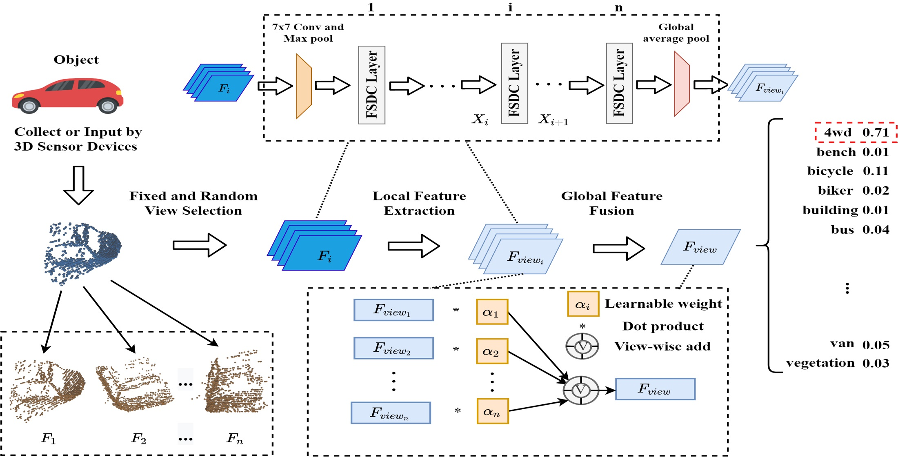

# PyTorch code for FSDCNet 
A Pytorch implementation of "Fusion of a Static and Dynamic Convolutional Neural Network for Multiview 3D Point Cloud Classification"

More information about the paper is in [here](https://www.mdpi.com/2072-4292/14/9/1996#cite)



## Dependencies
* Blender 2.92.0
* Python 3.6
* Cuda 10.1
* PyTorch 1.7.1
* torchvision 0.8.2
* Open3d
* Pandas
* numpy
* matplotlib

First, download [ModelNet40](http://modelnet.cs.princeton.edu/ModelNet40.zip) and [Sydney Urban Object](https://www.acfr.usyd.edu.au/papers/data/sydney-urban-objects-dataset.tar.gz) dataset and use [preprocessing.py](preprocessing/processing.py) to convert all samples to pcd format files.

Second, use blender to render it to 2D Images. You can refer to the [tutorial](http://people.cs.umass.edu/~jcsu/papers/shape_recog/render_shaded_black_bg.blend) and our codes [render.py](preprocessing/render.py).

Third, when you get png files of these multi-view pointcloud, put it in specified directory and execute the following command:  
 
```python train_FSDCNet.py -name FSDCNet -num_models 1000 -lr 0.0001 -weight_decay 0.0001 -num_views 6 -bs 16 -cnn_name dy_resnet50```

If you find FSDCNet useful in your research, please consider citing. Many thanks!

```
Wang, W.; Zhou, H.; Chen, G.; Wang, X. Fusion of a Static and Dynamic Convolutional Neural Network for Multiview 3D Point Cloud Classification. Remote Sens. 2022, 14, 1996. https://doi.org/10.3390/rs14091996

@article{wang2022fusion,
  title={Fusion of a Static and Dynamic Convolutional Neural Network for Multiview 3D Point Cloud Classification},
  author={Wang, Wenju and Zhou, Haoran and Chen, Gang and Wang, Xiaolin},
  journal={Remote Sensing},
  volume={14},
  number={9},
  pages={1996},
  year={2022},
  publisher={MDPI}
}
 ```

  

